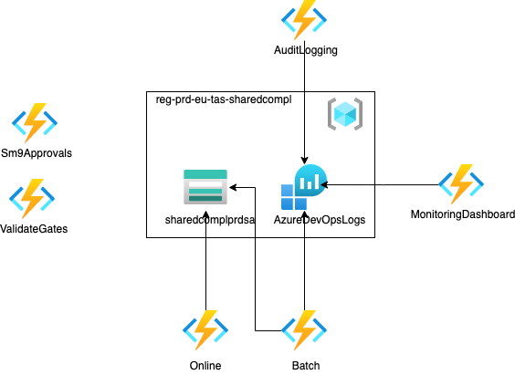

# Introduction 
Compliancy framework contains all the compliancy functions.
The functions are separated in multiple function apps that are deployed seperately.

See Readme of each function app for more information about that specific function app.

- [AuditLogging](/src/Functions/AuditLogging/README.md)
- [ComplianceScanner - Online](/src/Functions/ComplianceScanner/Online/README.md)
- [ComplianceScanner - Batch](/src/Functions/ComplianceScanner/Batch/README.md)
- [Sm9Changes](/src/Functions/Sm9Changes/README.md)
- [ValidateGates](/src/Functions/ValidateGates/README.md)
- [MonitoringDashboard](/src/Functions/MonitoringDashboard/README.md)
- [PipelineBreaker](/src/Functions/PipelineBreaker/Decorator/README.md)

# Getting Started
- https://docs.microsoft.com/en-us/azure/azure-functions/functions-reference
- https://docs.microsoft.com/en-us/azure/azure-functions/functions-develop-local

# Build and Test
- dotnet build
- dotnet test

# Architecture
- Diagrams are made with https://app.diagrams.net/
- Azure icons: https://github.com/ourchitecture/azure-drawio-icons
- Recommended to use the 'Draw.io integration' vscode extension

## Deployment diagrams
