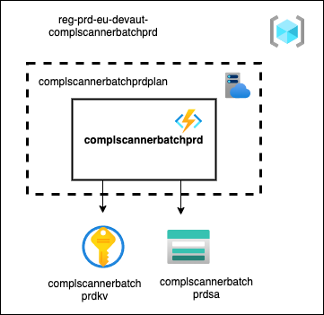

# Introduction 
CompliancyScannerBatch is an Azure function app that contains the following functions:

## 1. ProjectScan
### time triggered daily at 19:00 CET

This function executes a compliancy scan for all Azure DevOps projects 
and provides the results to Log Analytics and Extension Data Management Storage.

## 2. ImportPipelineRegistrations
### time triggered daily at 18:00 CET

This function retrieves all pipeline registrations of configuration items in the CMDB
and stores these registrations in Azure Table Storage.

# Getting Started
- https://docs.microsoft.com/en-us/azure/azure-functions/functions-reference
- https://docs.microsoft.com/en-us/azure/azure-functions/functions-develop-local

# Build and Test
- dotnet build
- dotnet test

# Configuration

## Functional users
Connection with the Azure DevOps API is made with a PAT generated with the following accounts:
- eu.ComplScanBatch01
- eu.ComplScanBatch02
- eu.ComplScanBatch03
- eu.ComplScanBatch04
- eu.ComplScanBatch05
- eu.ComplScanBatch06
- eu.ComplScanBatch07
- eu.ComplScanBatch08
- eu.ComplScanBatch09
- eu.ComplScanBatch10

### Overview all Functional user accounts and expiration date of the PATs
Overview can be found on [this Confluence page](https://confluence.dev.rabobank.nl/x/SBNGF).

# Architecture
- Diagrams are made with https://app.diagrams.net/
- Azure icons: https://github.com/ourchitecture/azure-drawio-icons
- Recommended to use the 'Draw.io integration' vscode extension

## Context diagrams
### Project scan

### ImportPipelineRegistrations

## Deployment diagrams
