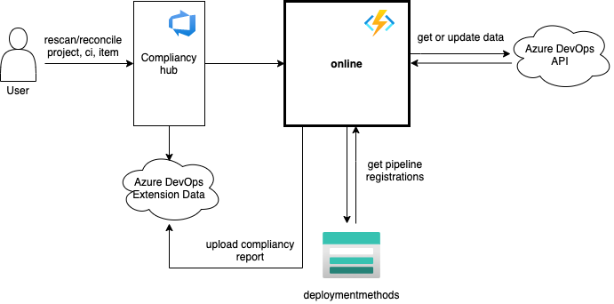
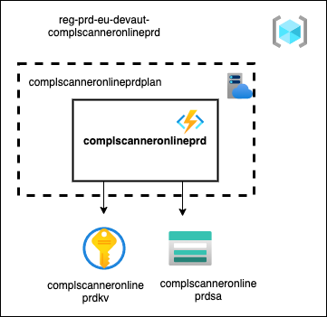

# Introduction 
CompliancyScannerOnline is an azure function app that contains the following functions:

## 1. RegisterPipeline
### http trigger: register/{organization}/{projectId}/{pipelineId}

This function is started when a user clicks on a register button in the Compliancy Hub.
A pipeline is registered in the CMDB and the pipeline registration is added to Azure Table Storage.
In addition, in case of a prod registration, a webhook is created in Azure DevOps for audit logging purposes.

## 2. Reconcile
### http trigger: reconcile/{organization}/{projectId}/{ruleName}/{itemId}

This function is started when a user clicks on a reconcile button in the Compliancy Hub.
An incompliant repository, pipeline or project setting is updated to make it comply to the security rule.

## 3. ProjectRescan
### http trigger: scan/{organization}/{projectId}

This function is started when a user clicks on a rescan button on project level in the Compliancy Hub.
It executes a compliancy scan for a single project and provides the results in Extension Data Management Storage. 

## 4. CiRescan
### http trigger: scan/{organization}/{projectId}/{ciIdentifier}

This function is started when a user clicks on a rescan button on configuration item level in the Compliancy Hub.
It executes a compliancy scan for a single configuration item and provides the results in Extension Data Management Storage. 

## 5. ItemRescan
### http trigger: scan/{organization}/{projectId}/{ruleName}/{itemId}

This function is started when a user clicks on a rescan button on item level in the Compliancy Hub.
It executes a compliancy scan for a single rule/item and provides the results in Extension Data Management Storage. 

## 6. RegisterDeviation
### http trigger: register-deviation/{organization}/{projectId}/{ruleName}/{itemId}

This function is started when a user clicks on a register-deviation button in the Compliancy Hub.
The user input about why a rule is incompliant is logged in Table Storage and in Extension Data Management Storage.

## 7. DeleteDeviation
### http trigger: delete-deviation/{organization}/{projectId}/{ruleName}/{itemId}

This function is started when a user clicks on a delete-deviation button in the Compliancy Hub.
An existing deviation report is removed from both Table Storage and Extension Data Management Storage.

## 8. OpenPermissions
### http trigger: open-permissions/{organization}/{projectId}/{itemType}/{itemId}

This function is started when a user clicks on an open-permissions button in the Compliancy Hub.
It verifies if the item has been used for prod deployments and if not sets the delete permissions for this item to Allow. 

# Getting Started
- https://docs.microsoft.com/en-us/azure/azure-functions/functions-reference
- https://docs.microsoft.com/en-us/azure/azure-functions/functions-develop-local

# Build and Test
- dotnet build
- dotnet test

# Configuration

## Functional users
Connection with the Azure DevOps API is made with a PAT generated with the following accounts:
- eu.ComplScanOnline01
- eu.ComplScanOnline02
- eu.ComplScanOnline03

### Overview all Functional user accounts and expiration date of the PATs
Overview can be found on [this Confluence page](https://confluence.dev.rabobank.nl/x/SBNGF).

# Architecture
- Diagrams are made with https://app.diagrams.net/
- Azure icons: https://github.com/ourchitecture/azure-drawio-icons
- Recommended to use the 'Draw.io integration' vscode extension

## Context diagrams
### Rescan + Reconcile functions

### RegisterPipeline

## Deployment diagrams
