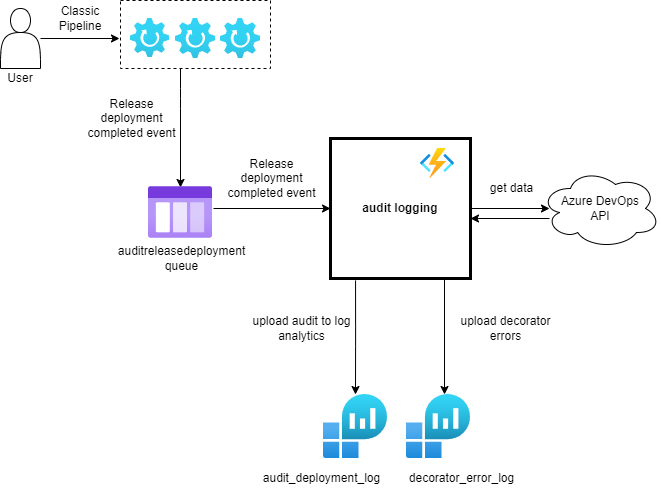
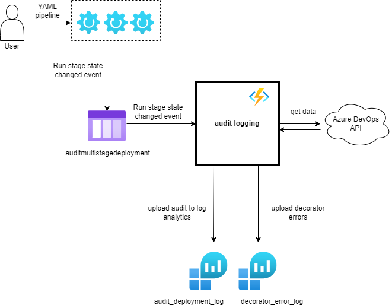
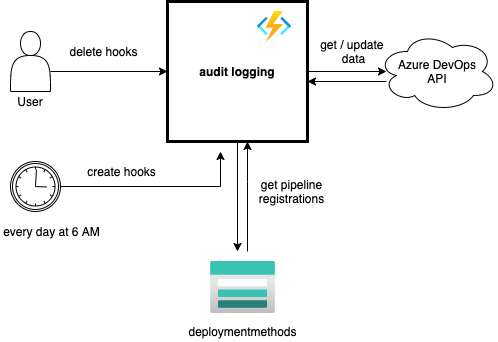
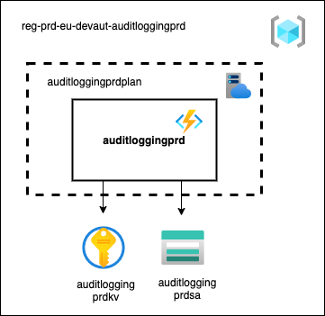

# Introduction 
AuditLogging is an azure function app that contains the following functions:

## 1. AuditLoggingClassicRelease
### queue triggered via hooks by a release-deployment-completed event

This function logs the compliancy state of a production release executed with a classic release pipeline.

It also parses the log output of the pre-job (pipelinebreaker decorator) to check if there is any unexpected logging.
If this is the case, a logrecord is written in LogAnalytics in the table 'decorator_error_log_CL'

## 2. AuditLoggingYamlRelease
### queue triggered via hooks by a pipelines-stage-state-changed event

This function logs the compliancy state of a production release executed with a yaml release pipeline.

It also parses the log output of the pre-job (pipelinebreaker decorator) to check if there is any unexpected logging.
If this is the case, a logrecord is written in LogAnalytics in the table 'decorator_error_log_CL'

## 3. ManageHooks
### time triggered daily at 06:00 CET 

This function creates a service hook for every pipeline that is registered as production pipeline. Creating hooks for Raboweb takes about 2 hours.
Furthermore the function removes duplicate and invalid hooks and creates an exception report in log analytics for hooks that failed to trigger the function.

## 4. DeleteHooks
### disabled (only manual trigger)

This function deletes all service hooks that are used for audit logging.

# Getting Started
- https://docs.microsoft.com/en-us/azure/azure-functions/functions-reference
- https://docs.microsoft.com/en-us/azure/azure-functions/functions-develop-local

# Build and Test
- dotnet build
- dotnet test

# Configuration

## Functional users
Connection with the Azure DevOps API is made with a PAT generated with the following accounts:
- eu.AuditLogging01
- eu.AuditLogging02
- eu.AuditLogging03

### Overview all Functional user accounts and expiration date of the PATs
Overview can be found on [this Confluence page](https://confluence.dev.rabobank.nl/x/SBNGF).

# Architecture
- Diagrams are made with https://app.diagrams.net/
- Azure icons: https://github.com/ourchitecture/azure-drawio-icons
- Recommended to use the 'Draw.io integration' vscode extension

## Context diagrams
### AuditLoggingClassicRelease

### AuditLoggingYamlRelease

### CreateHooks and DeleteHooks

## Deployment diagrams
