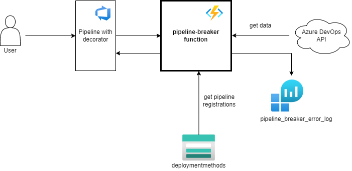

# Introduction 
PipelineBreaker is an Azure function app that contains the following function:

## 1. PipelineBreakerFunction
### http trigger: pipeline-compliant/{organization}/{projectId}/{runId}/{stageId}/{pipelineType}

This function is called by the pipeline decorator for each job in a pipelinerun and will check if a pipelines needs to be blocked depending on its
registration, type of pipeline and if it is compliant. Build pipelines do not need to be registered.

The pipelineType can have the following values:
- Build -> This value must be specified for classic build pipelines or Yaml (multistage) pipelines
- Release - This value must be specified for classic release pipelines

The runId will be passed from the decorator and will be the buildId or the releaseId depending on type of pipeline
The function will always return an HTTP200 (or HTTP500 when an unhandled exception occurs).
Warning messages start with "WARNING:" and error messages start with "ERROR:"

# Getting Started
- https://docs.microsoft.com/en-us/azure/azure-functions/functions-reference
- https://docs.microsoft.com/en-us/azure/azure-functions/functions-develop-local

# Build and Test
- dotnet build
- dotnet test

# Configuration
The appSettings contain the following flags:

- blockUnregisteredPipelinesEnabled -> When this flag is set to 'true' a warning message will be sent when the pipeline 
should be registered while it is not.
- blockIncompliantPipelinesEnabled -> When this flag is set to 'true' an error message wil be sent if a production pipeline
is not compliant. This setting overrides the throwWarningsIncompliantPipelinesEnabled setting.
- throwWarningsIncompliantPipelinesEnabled -> When this flas is set to 'true' a warning message will be sent if a production
pipeline is not compliant.

## Functional users
Connection with the Azure DevOps API is made with a PAT generated with the following accounts:
- eu.PipelineBreaker01
- eu.PipelineBreaker02
- eu.PipelineBreaker03
- eu.PipelineBreaker04
- eu.PipelineBreaker05

### Overview all Functional user accounts and expiration date of the PATs
An overview can be found on [this Confluence page](https://confluence.dev.rabobank.nl/x/SBNGF).

# Architecture
- Diagrams are made with https://app.diagrams.net/
- Azure icons: https://github.com/ourchitecture/azure-drawio-icons
- Recommended to use the 'Draw.io integration' vscode extension

## Context diagrams
### pipelinebreaker function

