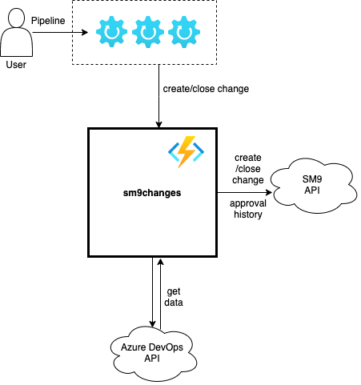
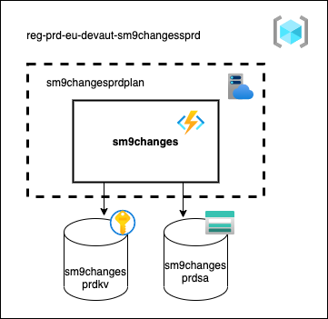

# Introduction 
Sm9Changes is an azure function app that contains the following functions:

## 1. CreateChangeFunction
### create-change/{projectName}/{pipelineType}/{runId}

This function creates a change in SM9 from a classic release pipeline or a yaml pipeline.
## 2. CloseChangeFunction
### close-change/{projectName}/{pipelineType}/{runId}

This function closes a change in SM9 from a classic release pipeline or a yaml pipeline.

# Getting Started
- https://docs.microsoft.com/en-us/azure/azure-functions/functions-reference
- https://docs.microsoft.com/en-us/azure/azure-functions/functions-develop-local

# Build and Test
- dotnet build
- dotnet test

# Configuration

## Functional users
Connection with the Azure DevOps API is made with a PAT generated with the following accounts:
- eu.SM9approval01@rabobank.com
- eu.SM9approval02@rabobank.com
- eu.SM9approval03@rabobank.com

# Architecture
- Diagrams are made with https://app.diagrams.net/
- Azure icons: https://github.com/ourchitecture/azure-drawio-icons 

## Context diagrams

## Deployment diagrams

