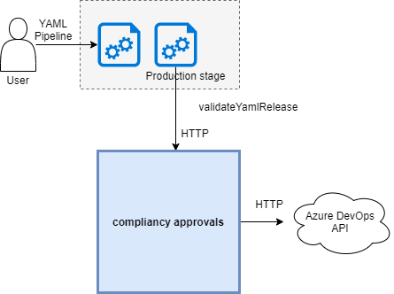
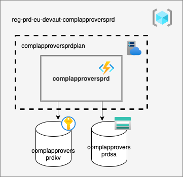

# Introduction 
ValidateGates is an azure function app that contains the following functions:

## 1. ValidateClassicRelease
### validate-gate/{projectId}/{releaseId}

This function checks whether a pull request approval or a pipeline approval has been provided.

## 2. ValidateYamlRelease
### v2/validate-environment/{projectId}/{runId}

This function checks whether a pull request approval or a pipeline approval has been provided.

# Getting Started
- https://docs.microsoft.com/en-us/azure/azure-functions/functions-reference
- https://docs.microsoft.com/en-us/azure/azure-functions/functions-develop-local

# Build and Test
- dotnet build
- dotnet test

# Configuration

## Functional users
Connection with the Azure DevOps API is made with a PAT generated with the following accounts:
- eu.ValidateGate01@rabobank.com
- eu.ValidateGate02@rabobank.com
- eu.ValidateGate03@rabobank.com

### Overview all Functional user accounts and expiration date of the PATs
Overview can be found on [this Confluence page](https://confluence.dev.rabobank.nl/x/SBNGF).

# Architecture
- Diagrams are made with https://app.diagrams.net/
- Azure icons: https://github.com/ourchitecture/azure-drawio-icons 

## Context diagrams

### ValidateClassicRelease

### ValidateYamlRelease

## Deployment diagrams
